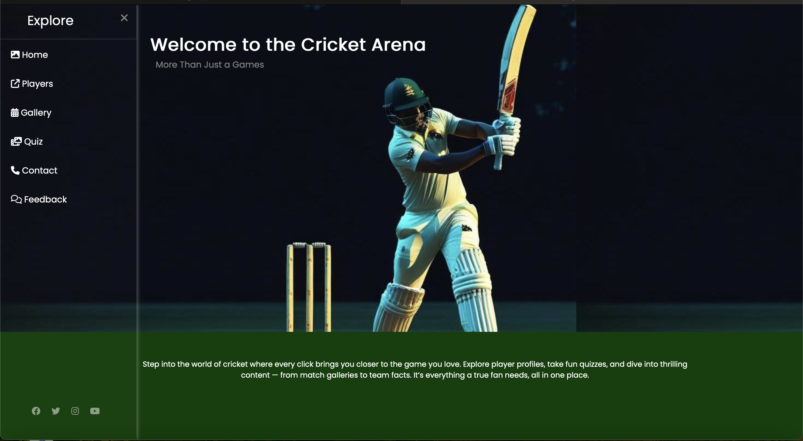
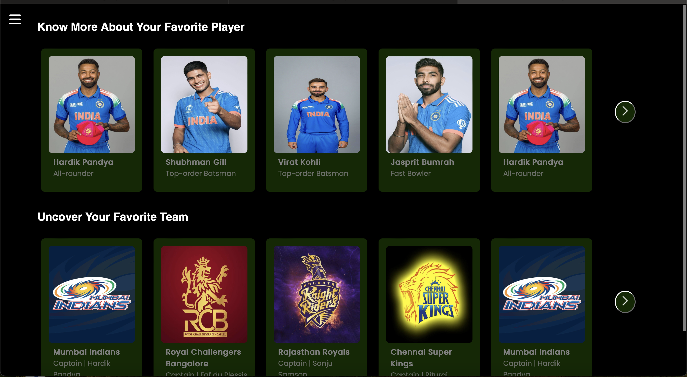

# Cricket-Website

Hi! I'm a beginner learning web development, and Cricket Arena is one of my first projects. It’s a simple website made using just HTML and CSS.

## Tech Stack

## Features-

- Navigation bar: Fully styled navigation bar with hover effects, icons, and consistent color scheme. It uses a creative <b>checkbox toggle trick</b> which enables toggling a sidebar without JavaScript.
- Home page: Consists of an animated heading with background image and intro text at the footer.
- Players page: A responsive flexbox of cards for exploring players and teams.
- Gallery page: Built using <b>CSS Grid</b> for a clean and responsive layout with hover effects and spacing handled with pure CSS, showcases iconic cricket moments.
- Quiz Section (Pending): Plan to build a quiz section with using HTML/CSS (JS later) for better user engagement.

## How to Run

### Option 1: Run locally

1. Clone this repository or download the ZIP
2. Open the folder in your code editor
3. Open `index.html` in your browser

### Option 2: View Live

This project is hosted on GitHub Pages:  
👉 [Live Demo](https://saimafbegum.github.io/cricket-website/)

## Screenshot

